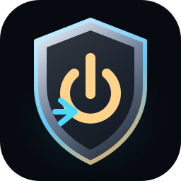
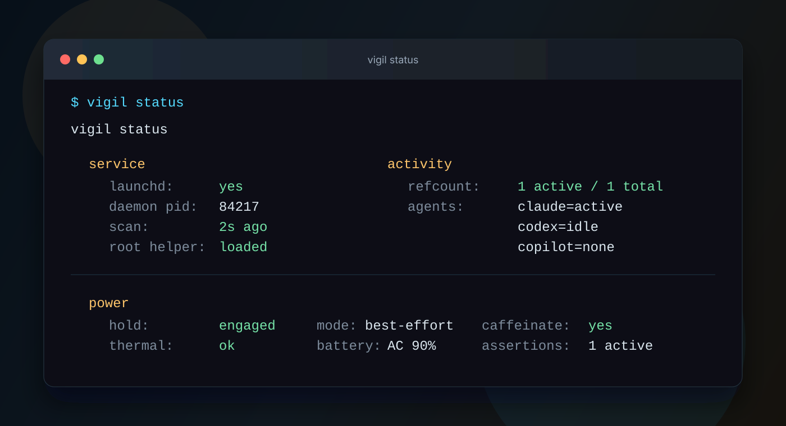

# Vigil

<p align="center">
  
</p>

<p align="center">
  <strong>Keep AI coding agents running while your Mac can lock, sleep its display, and stay inside battery and thermal guardrails.</strong>
</p>

<p align="center">
  <a href="#install">Install</a> ·
  <a href="#daily-use">Daily use</a> ·
  <a href="#agent-coverage">Agent coverage</a> ·
  <a href="#how-it-works">How it works</a> ·
  <a href="#safety-model">Safety model</a> ·
  <a href="./ROADMAP.md">Roadmap</a>
</p>


> **Status: pre-release.** macOS is feature-complete through the Rust rewrite, local lock guard, launchd service, root helper, and UX overhaul. Linux support is underway in Phase 5.8; Windows follows in Phase 5.9. There is no version tag, Homebrew tap, or GitHub release yet.

## What Vigil Is

Vigil is a small systems utility for a specific workflow: you start an AI coding agent, let the display sleep or lock the Mac, and expect the agent to keep working until it is actually idle.

Generic keep-awake tools hold the machine awake whenever you ask. Vigil watches the agent surfaces you use, counts only active work, releases when the work goes idle, and refuses to keep the machine awake through thermal pressure or a low battery.

The current implementation is a Rust workspace:

- one user-facing `vigil` binary with CLI, setup, install, daemon, status, doctor, config, wrapper, and completion commands;
- one privileged `vigil-root-helper` binary that owns the narrow `pmset` boundary on macOS;
- one native `vigil-lock-helper` binary for the optional local input-freeze guard.

There is no shell daemon and no `bin/` or `lib/` shell tree.

## At A Glance

| Area | Current behavior |
| --- | --- |
| Sleep hold | `pmset disablesleep=1` plus `caffeinate -i` while active work exists. |
| Display policy | No display-awake assertion by default; displays can sleep and macOS can lock. |
| Agent signal | Process detection plus session-activity gates, not just "process exists". |
| Release policy | Releases on idle, thermal pressure, or battery floor while unplugged. |
| Baseline | Restores the prior `SleepDisabled` state instead of clobbering another tool. |
| Runtime privilege | Normal runtime does not execute `sudo`; power transitions go through the installed root helper. |
| Install model | `vigil setup` copies an install snapshot into `~/Library/Application Support/vigil/bin/` for launchd/TCC stability and links the dev build onto `PATH`. |

## Agent Coverage

| Surface | Detection model | Activity gate |
| --- | --- | --- |
| Claude Code CLI | `claude` basename | Recent writes under `~/.claude/projects/` |
| Claude.app Local Agent Mode | Bundled `claude` worker | Same Claude session activity |
| Codex CLI | `codex` basename | Recent writes under `~/.codex/sessions/` |
| Codex.app | Electron host carved out before `/Applications/` exclusion | Same Codex session activity |
| OpenAI ChatGPT VS Code extension | Transitive bundled `codex` worker | Same Codex session activity |
| GitHub Copilot CLI | `copilot` basename, including `copilot --acp` workers | Recent writes under `~/.copilot/session-state/` |
| VS Code + GitHub Copilot Chat | VS Code/Insiders host process plus chat storage scan | Semantic content-hash changes in `workspaceStorage/*/chatEditingSessions/*/state.json` |

The long-lived `node` router used by companion-style tools is intentionally excluded when its command line carries the `node_repl` token; Vigil watches the actual `copilot` worker instead.

Deferred surfaces, including standalone GitHub Copilot.app and Antigravity/Gemini CLI, are tracked in [`ROADMAP.md`](./ROADMAP.md) and [`future/phase-N-agent-surface-refresh.md`](./future/phase-N-agent-surface-refresh.md).

## Install

The install path below is the supported macOS path while the project is pre-release. Linux work has started, but Phase 5.8 is not complete yet.

```bash
git clone https://github.com/thangaram611/vigil.git ~/Documents/projects/personal/vigil
cd ~/Documents/projects/personal/vigil

cargo build --release
./target/release/vigil setup --dry-run
./target/release/vigil setup
vigil doctor
```

`vigil setup --dry-run` prints the planned paths and touches nothing. Add `--verbose` to print generated plist and newsyslog bodies before installation.

`vigil setup` performs five concrete steps:

1. Creates user state and log directories.
2. Builds and copies `vigil` plus `vigil-lock-helper` into `~/Library/Application Support/vigil/bin/`.
3. Installs the root LaunchDaemon helper and its per-user IPC directory matrix.
4. Installs `/etc/newsyslog.d/vigil.conf` for daemon log rotation.
5. Installs and bootstraps the user LaunchAgent.

After setup, `vigil` is available on `PATH` through `~/.local/bin/vigil`, a symlink to the dev build. The LaunchAgent still runs the copied install snapshot, which is required because macOS TCC grants are tied to the executable path and signature. Override the link directory with `VIGIL_BIN_LINK_DIR`.

Useful install commands:

```bash
vigil setup --dry-run --verbose
vigil setup --yes
vigil reload
vigil uninstall
```

`vigil uninstall` removes the helper, newsyslog entry, LaunchAgent, install state, and runtime state. Logs under `~/Library/Logs/vigil` are preserved, and the `~/.local/bin/vigil` symlink is left in place so setup can reinstall from the checkout.

## Daily Use

```bash
vigil status
vigil status --verbose
vigil status --json
vigil doctor
vigil doctor --power
vigil log
vigil log -f
```

Wrap a one-off command when you want an explicit hold for the full child lifetime:

```bash
vigil run claude
vigil run codex
vigil run copilot
```

To wrap an existing alias:

```diff
- alias claudex="claude --dangerously-skip-permissions --chrome --plugin-dir ..."
+ alias claudex="vigil run claude --dangerously-skip-permissions --chrome --plugin-dir ..."
```

`vigil run` keeps the child in the foreground, removes its wrapper pidfile on exit, and propagates the child exit code. A signal-terminated child returns `128 + signal`; command-not-found returns `127`.



## Command Surface

| Command | Use |
| --- | --- |
| `vigil setup` | Install the user LaunchAgent, root helper, log rotation, install snapshot, and PATH link. |
| `vigil start` / `vigil stop` | Bootstrap or boot out the LaunchAgent. |
| `vigil reload` | Rebuild, re-sync install binaries, heal the PATH link, and restart launchd. |
| `vigil status` | Print service, activity, and power state. |
| `vigil doctor` | Diagnose installation readiness. |
| `vigil doctor --power` | Focus on `pmset`, helper, `caffeinate`, and assertion state. |
| `vigil run <cmd>` | Hold sleep prevention for an explicit foreground command. |
| `vigil lock` | Arm the local input-freeze guard. |
| `vigil lock setup` | Capture or set the ordered unlock chord. |
| `vigil lock doctor` | Check Input Monitoring, Accessibility, and event-tap readiness. |
| `vigil config` / `vigil config --json` | Print the fully resolved configuration. |
| `vigil completions <shell>` | Emit shell completions. |
| `vigil uninstall` | Remove install components and restore the baseline. |

Immediately after `start`, `reload`, or login, `vigil status` may briefly report `pending first scan` or `expected hold: pending` while launchd has started the daemon but the first tick has not completed.

## Configuration

Vigil reads strict TOML from `$VIGIL_CONFIG_FILE` or `~/.config/vigil/vigil.conf`. Shell-style `export`, `$VAR`, and `KEY=value` files are rejected clearly.

Every field can also be set through a `VIGIL_<FIELD>` environment variable, which overrides TOML. Inspect the final values with:

```bash
vigil config
vigil config --json
```

Common knobs:

| Setting | Default | Meaning |
| --- | --- | --- |
| `VIGIL_IDLE_AFTER_SEC` | `300` | Session-activity window before an agent is considered idle. |
| `VIGIL_TICK_SECS` | `5` | Daemon tick interval. |
| `VIGIL_BATTERY_FLOOR_PCT` | `20` | Battery cutoff while unplugged. |
| `VIGIL_START_WAIT_SECS` | `6` | First-scan and lock pre-arm wait bound. |
| `VIGIL_LOCK_COMBO` | `ctrl+alt+shift+cmd+l` | Default local lock unlock chord. |
| `VIGIL_LOCK_MAX_SECS` | `28800` | Default local lock watchdog timeout. |
| `VIGIL_INSTALL_DIR` | `~/Library/Application Support/vigil` | Install snapshot, helper queue, and runtime tree. |
| `VIGIL_BIN_LINK_DIR` | `~/.local/bin` | Directory where `setup` links the dev build onto `PATH`. |

Provider homes honor the native provider variables (`CLAUDE_CONFIG_DIR`, `CODEX_HOME`, `COPILOT_HOME`) and Vigil-specific overrides (`VIGIL_CLAUDE_HOME`, `VIGIL_CODEX_HOME`, `VIGIL_COPILOT_HOME`).

## Local Lock Guard

`vigil lock` freezes local mouse, keyboard, and scroll input until an ordered unlock chord is pressed. Display sleep and the native macOS Lock Screen are still allowed.

This is a local input-freeze guard, not a replacement for the macOS login screen. If macOS locks while the guard is armed, login input passes through. After login, the Vigil chord is still required before desktop input is released.

```bash
vigil lock
vigil lock --combo ctrl+alt+l
vigil lock --max-secs 0
vigil lock --countdown 0
vigil lock setup
vigil lock setup --combo ctrl+alt+shift+l --max-secs 3600
vigil lock doctor
vigil lock doctor --prompt
```

The unlock chord is ordered: `ctrl+l+alt` is not the same as `ctrl+alt+l`. It must contain at least three keys and may mix modifiers and regular keys. The overlay shows a generic "Press your unlock chord to continue" hint and never displays the literal combo.

Required macOS grants: **Input Monitoring** and **Accessibility**. Run `vigil lock doctor` before arming.

Recovery command:

```bash
pkill -TERM vigil-lock-helper
```

For the event-tap boundary and locked-use details, read [`docs/macos-lock-and-locked-use.md`](./docs/macos-lock-and-locked-use.md).

## How It Works


Two launchd jobs drive macOS runtime behavior:

- **LaunchAgent `com.thangaram.vigil`** runs `<install_dir>/bin/vigil daemon` as the user. The daemon ticks every `VIGIL_TICK_SECS`, detects agent processes, applies activity gates, garbage-collects stale pidfiles, evaluates thermal and battery cutoffs, and decides whether a hold should be engaged.
- **LaunchDaemon `com.thangaram.vigil.helper`** runs `vigil-root-helper --serve` as root. It accepts only `engage`, `release`, and `status` through a per-uid filesystem request/response queue. The helper validates request files by file descriptor and runs only fixed `/usr/bin/pmset -a disablesleep 0|1` argv.

The daemon also owns a `caffeinate -i` child while active work exists. It never uses a display-awake assertion by default, so macOS can still turn displays off and show the Lock Screen.

`status` and `doctor` are read-only surfaces over one `CheckEngine`: they scan pid/tick/state files plus launchd state, but do not refresh, write, or garbage-collect anything. Their helper-liveness probe is capped at 2 seconds so a dead helper does not block the status paint behind the daemon's longer power timeout.

Deep dives:

- [`docs/architecture.md`](./docs/architecture.md) — daemon, helper, IPC, refcount, baseline, status/doctor internals.
- [`docs/apple-silicon-lid-closed.md`](./docs/apple-silicon-lid-closed.md) — why closed-lid behavior on Apple Silicon is best effort.
- [`docs/testing.md`](./docs/testing.md) — test conventions, especially bounded CPU hog safety.

## Safety Model

Vigil is intentionally conservative:

- Normal runtime does not execute `sudo`.
- The daemon never builds a privileged command from request content.
- The root helper accepts only `engage`, `release`, and `status`.
- Request and response files are validated with `O_NOFOLLOW` plus fd-based metadata checks.
- The helper runs a fixed `pmset` argv with a cleared environment and pinned `PATH`.
- Thermal pressure releases the hold.
- Low battery while unplugged releases the hold.
- Baseline restoration avoids clobbering another tool's `SleepDisabled` state.
- Admin paths refuse test mode (`VIGIL_TEST_NO_ADMIN`) and refuse environment-overridden privileged install paths.

The tradeoff is explicit: Vigil avoids repeated runtime sudo prompts by owning a persistent privileged component. Treat the helper queue as a real privilege boundary.

## Apple Silicon Lid-Closed Caveat

Vigil uses the strongest public macOS path available for this workflow: `pmset disablesleep` plus `caffeinate -i`.

On Apple Silicon, macOS can still enter hardware-level magnet-sensor sleep when the lid closes without an external display. In practice the `pmset disablesleep` path works much of the time, but the only Apple-supported closed-lid workflow is clamshell mode: external display, power, and input.

If you depend on overnight closed-lid runs, use clamshell mode. See [`docs/apple-silicon-lid-closed.md`](./docs/apple-silicon-lid-closed.md).

## Roadmap

The current next track is multi-OS support:

1. **Phase 5.8 Linux** — implementation has started. Compile baseline, platform power facade, logind `idle:sleep` hold, Linux battery/thermal collectors, and focused power status/doctor text are in place. Systemd user service install is next.
2. **Phase 5.9 Windows** — planned after Linux, based on `SetThreadExecutionState`, Task Scheduler logon tasks, and Windows battery/power probes.
3. **Phase 6 native UI surfaces** — deferred menu-bar/tray/full GUI work.
4. **Emerging agent surfaces** — deferred until tools such as Antigravity/Gemini CLI are stable enough to fresh-install and verify locally.

See [`ROADMAP.md`](./ROADMAP.md) and the files under [`future/`](./future/).

## Development

Default verification for real changes:

```bash
cargo fmt --check
cargo build
cargo clippy -p vigil --all-targets -- -D warnings
cargo test
```

Use the helper test seam only when explicitly testing the helper subprocess boundary:

```bash
cargo test --features helper-test-seam
```

Tests that spawn CPU-burning or long-lived children must use `BoundedCpuHog` or an equivalent self-bounded process-group guard. Do not hand-roll unbounded `while :; do :; done` children. See [`docs/testing.md`](./docs/testing.md).

## Acknowledgements

Direction-setting and design references:

- [`CharlonTank/agents-sleep-preventer`](https://github.com/CharlonTank/agents-sleep-preventer) — tick loop, thermal probe, refcount discipline.
- [`hiddenest/awake`](https://github.com/hiddenest/awake) — `caffeinate` lifecycle pattern, session-aware providers model.
- [`iccir/Fermata`](https://github.com/iccir/Fermata) — confirmed via `Source/AppleSPI.h` and `RestlessEngine.m` that the private SPI uses the same `kIOPMSleepDisabledKey` as `pmset disablesleep`.
- [`segevfiner/keepawake-rs`](https://github.com/segevfiner/keepawake-rs) — cross-OS sleep prevention reference for Linux/Windows.

## License

MIT — see [`LICENSE`](./LICENSE).
