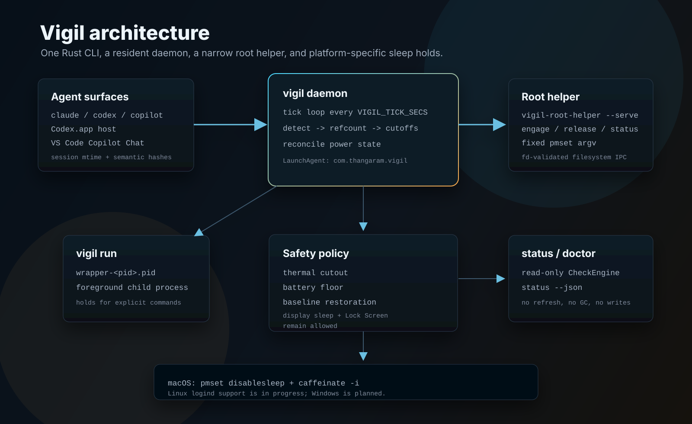

# Architecture



## Current (Rust, single self-contained binary)

There is no bash daemon and no `lib/*.sh` anymore — those were deleted in the
5.7 cutover. Vigil is a single Rust workspace. The user-facing `vigil` binary
runs the resident daemon under a hidden `daemon` subcommand; a separate root
binary, `vigil-root-helper`, runs the privileged power helper. The two
communicate only through a per-uid, file-based IPC queue. A third native binary,
`vigil-lock-helper`, implements the optional input-freeze (`vigil lock`).

```
                ┌─────────────────────────────────────────────────┐
                │ launchd LaunchAgent (gui/{uid}, KeepAlive)      │
                │   com.thangaram.vigil                           │
                │   ProgramArguments = [<install>/bin/vigil,      │
                │                       daemon]                   │
                └──────────────────────┬──────────────────────────┘
                                       │ runs
                                       ▼
   ┌────────────────────────────────────────────────────────────────┐
   │ vigil daemon  (Rust tick loop, default 5s, VIGIL_TICK_SECS)    │
   │  ├─ procscan: one long-lived sysinfo::System, refresh cmd+exe  │
   │  │     match: cli-claude/codex/copilot, app-codex,             │
   │  │            app-vscode-copilot-chat                          │
   │  ├─ refcount: one *.pid file per match in state/active/        │
   │  ├─ activity gates: session-mtime (claude/codex/copilot) +     │
   │  │     VS Code Copilot Chat content-hash                       │
   │  ├─ thermal: pmset -g therm (CPU_Scheduler_Limit floor)       │
   │  ├─ battery: pmset -g ps (VIGIL_BATTERY_FLOOR_PCT)            │
   │  ├─ on engage: snapshot baseline.json + caffeinate -i         │
   │  └─ on release: kill caffeinate + clear baseline.json         │
   └───────────────────────────────┬────────────────────────────────┘
                                    │ per-uid IPC queue (req.<id>/resp.<id>)
                                    │ exactly one of engage / release / status
                                    ▼
   ┌────────────────────────────────────────────────────────────────┐
   │ launchd LaunchDaemon (system, KeepAlive)                       │
   │   com.thangaram.vigil.helper                                   │
   │   vigil-root-helper --serve  (long-lived poll loop, root)     │
   │  ├─ claim req via renameat into root-owned processing/        │
   │  ├─ fstat-validate: regular, owner==allowed-uid, nlink==1,    │
   │  │     not group/other-writable, body ≤ 64 bytes              │
   │  ├─ accept only one action: engage / release / status         │
   │  └─ run FIXED /usr/bin/pmset -a disablesleep 0|1 (env_clear)  │
   └───────────────────────────────▲────────────────────────────────┘
                                    │
                writes wrapper PID  │
                file (RAII guard)   │
   ┌────────────────────────────────┴───────────────────────────────┐
   │ vigil run <cmd> [args...]                                       │
   │   - write wrapper-<pid>.pid into state/active/                  │
   │   - run "<cmd> args" as a foreground subprocess (NOT exec)      │
   │   - RAII PidfileGuard removes the pidfile on return             │
   │   - propagate child exit code (128+sig on signal, 127 ENOENT)  │
   └────────────────────────────────────────────────────────────────┘

   status/doctor read this whole picture through ONE read-only CheckEngine:
   it scans pid/tick/state files + launchctl, never writes/refreshes/GCs.
```

## Signal flow

Two signals, one source of truth (the daemon's refcount):

1. **Process polling** — every tick (`tick_secs`, default 5,
   `VIGIL_TICK_SECS`) the daemon refreshes one long-lived `sysinfo::System`
   (command line + exe only, never cpu/memory). The pure classifier matches CLI
   basenames (`claude`/`codex`/`copilot`), the Codex.app host, and the VS Code
   host, after hard exclusions. Each match writes/refreshes
   `~/Library/Application Support/vigil/state/active/<name>-<pid>.pid` with the
   pid's `start_time`.

2. **Wrapper PID files** — `vigil run <cmd> [args...]` writes a
   `wrapper-<pid>.pid` file before running the child as a foreground subprocess
   (not via `exec`), and removes it via an RAII `PidfileGuard` on return. It
   propagates the child's exit code (signal-terminated → `128 + signal`,
   command-not-found → `127`).

Agent pidfiles are counted only when the agent's **activity gate** is on:
session-file mtime within the idle window for `claude`/`codex`/`copilot` (and
`app-codex` shares the `codex` gate), and a semantic content-hash change of VS
Code Copilot Chat `state.json` for `app-vscode-copilot-chat`. Wrapper pidfiles
always count. Per-tick transition rules:

- **0 → >0**: Capture the current `SleepDisabled` value into
  `state/baseline.json` (idempotently), submit an `engage` request to the root
  helper, and **only if** the helper engage succeeds, spawn `caffeinate -i`
  and record its PID.
- **>0 steady state**: `reconcile_engaged` re-reads `SleepDisabled`; if it is
  not `1` it re-submits `engage`, and if the recorded `caffeinate` child is not
  alive-by-identity it respawns. Baseline is never touched here.
- **>0 → 0**: Submit a `release` request, **always** kill the caffeinate child
  (even if release fails), and clear `baseline.json`. Idle releases on the
  helper side are no-ops, so a retained helper baseline cannot clobber a later
  third-party sleep setting.

Release priority is load-bearing when the hold drops for more than one reason:
thermal (soft release, keeps `baseline.json` for re-engage) > battery (full
release) > count==0 (full release).

Stale pidfiles are GC'd, in this branch order: (a) the PID is dead
(`kill(pid,0)` fails) → drop; (b) the on-disk `start_ts` doesn't match the live
PID's `start_time` (PID reuse) → drop; (c) for non-wrapper entries only, the
file is older than `stale_age_secs` (default 30) **and** the PID's CPU is below
`stale_cpu_pct` (default 0.5) → drop. The GC reads CPU off a second bare
`sysinfo::System` with two refreshes spaced by `MINIMUM_CPU_UPDATE_INTERVAL`,
because sysinfo's first cpu read is always `0.0` (a single refresh would drop
every busy agent).

## How the two launchd jobs are wired

- **LaunchAgent** `com.thangaram.vigil` (per-user, `gui/{uid}`): plist at
  `~/Library/LaunchAgents/com.thangaram.vigil.plist`. Its `ProgramArguments` is
  the two-element `["<install_dir>/bin/vigil", "daemon"]` — the installed
  snapshot binary plus the hidden `daemon` subcommand, never invoked directly by
  users. Keys: `RunAtLoad`, `KeepAlive`, `ProcessType=Background`,
  `ExitTimeOut=60` (sized for the cleanup path: helper release, kill caffeinate,
  drop baseline, release lock), `ThrottleInterval=10`. It carries a fixed
  `EnvironmentVariables` dict (`PATH`, `VIGIL_STATE_DIR`, `VIGIL_LOG_DIR`);
  stdout/stderr go to `daemon.out.log` / `daemon.err.log` under the log dir.

- **LaunchDaemon** `com.thangaram.vigil.helper` (system, root): plist at
  `/Library/LaunchDaemons/com.thangaram.vigil.helper.plist`. Its
  `ProgramArguments` is the frozen 14-element `vigil-root-helper --serve
  --request-dir … --response-dir … --state-dir … --log-file … --allowed-uid …
  --allowed-user …`. The `--allowed-uid`/`--allowed-user` are baked at install
  time from the current uid/username, never from request content. Keys:
  `RunAtLoad`, `KeepAlive`, `ProcessType=Background`, `ExitTimeOut=10`,
  `ThrottleInterval=10`. The `KeepAlive`+`ThrottleInterval=10` pair is what
  makes a crashed helper restart and re-validate. There is no
  `EnvironmentVariables` dict.

The labels `com.thangaram.vigil` and `com.thangaram.vigil.helper` are hardcoded
and never overridable. The live plist renderer in `service/mod.rs` is
authoritative; the stale template `etc/com.thangaram.vigil.plist.in` still shows
the old single-element `@VIGIL_DAEMON_PATH@` argv and is not the source of truth.

## The root helper: long-lived `--serve` with an IPC queue

`vigil-root-helper` is **not** a per-request one-shot. Its `main()` is a thin
shell: `parse_args` → `require_root` (`geteuid()==0`; the non-root bypass is
compile-time-only and cannot be flipped by any env var) → `--once` (one pass) or
`--serve` (forever loop `loop { run_once(); sleep(poll_secs) }`, `poll_secs`
default 1, floored ≥1). Each `--serve` iteration re-validates the IPC dirs,
cleans up `processing/` leftovers from a crashed prior instance (KeepAlive
restart), then processes pending requests; validation failures are swallowed and
retried next tick.

**IPC protocol.** The client (daemon) writes a request file `0600` via
`O_CREAT|O_EXCL` then atomically renames it to `req.<id>` (high-entropy id). The
helper claims it by `renameat`-ing it into the root-owned `processing/` subdir,
`O_NOFOLLOW`-opens the moved file, `fstat`s **that fd** (must be a regular file,
owner == allowed-uid, `nlink==1`, not group/other-writable), reads the body
bounded to 64 bytes from the **same fd**, and parses exactly one of
`engage|release|status` on a single newline-terminated line with no trailing
content. Every check operates on an fd's `fstat`, never a path-based
`metadata`/`is_file`, to close TOCTOU and symlink-redirect attacks. On any
rejection the helper removes the moved file and (when the id is charset-valid)
writes an error response, so a rejection never becomes a client timeout and the
queue never accumulates poison files. The helper writes a five-line
`key=value` response (`status/action/baseline/current/message`) via `O_CREAT|O_EXCL`
temp → `fchmod 0644` → `renameat` to `resp.<id>` relative to the validated
response-dir fd. The client polls the response dir up to
`power_helper_timeout_secs`, validates `resp.<id>` once with `O_NOFOLLOW` +
fstat (uid==0, regular, `nlink==1`, not group/other-writable) and reads from the
same fd. Helper validates requests, client validates responses; neither side's
validation is optimized away.

**Helper-side action semantics** (root):

- `engage`: idempotent baseline capture (read live `SleepDisabled`, write the
  helper's own `state_dir/baseline` `0600` unless already engaged + present),
  run `pmset` set 1, mark `state_dir/engaged`. On pmset failure → error,
  engaged is NOT marked.
- `release`: if NOT engaged → no-op (must not clobber an externally-set
  `SleepDisabled`); else target = the helper's baseline (corrupt/missing ⇒ 0,
  fail-safe), run `pmset` set target, mark released, KEEP the baseline file. On
  pmset failure → error, KEEP engaged for retry.
- `status`: always ok.

The helper keeps its own `baseline`/`engaged` state files under its `state_dir`,
distinct from the daemon-side `baseline.json`.

## Daemon tick loop

The daemon's per-tick order is load-bearing: (1) detect agents + write/refresh
one pidfile per match; (2) GC stale pidfiles on a separate bare `System`
reserved for the cpu probe; (3) compute per-agent activity flags
(claude/codex/copilot/vscode); (4) activity-filtered `refcount::count`; (5)
cutoff checks — thermal cut (fail-closed: an unreadable `pmset -g therm` cuts
the hold), then battery cut, then the sliding cooldown re-arm; (6)
decide `desired_hold = count>0 && !thermal && !battery && !cooling`; (7) act; (8)
write the frozen `daemon.tick` ABI file (POST-action engaged); (9) the caller
sleeps interruptibly (100ms granularity, honoring INT/TERM well within
`ExitTimeOut=60`).

Single-instance is guarded by an atomic-`mkdir` directory lock (not `flock` —
macOS lacks `flock(1)`); a dead recorded pid is taken over, a live one yields
and the process exits 0 (tolerated by `KeepAlive`+`ThrottleInterval=10`). Crash
recovery runs **before** the loop: refresh evidence first (the same
detect→touch→gc pass), recompute the startup count, evaluate thermal+battery,
and if a leftover `baseline.json` exists, reconcile-or-release against current
work. Clean shutdown runs on the main thread: full release if engaged → remove
the daemon pidfile and tick file → remove the lock dir → exit 0.

## status / doctor: the unified CheckEngine

`vigil status` and `vigil doctor` are both served by ONE read-only
`CheckEngine` that builds a `StatusSnapshot` plus a doctor checklist. It scans
live state, reads the pid/tick/state files, and probes `launchctl`, but never
writes/refreshes/GCs anything. Its helper-liveness probe is deliberately capped
at 2 seconds (`min(power_helper_timeout_secs, 2)`), far below the daemon's full
10-second engage/release timeout, so one dead or slow helper can't block the
status/doctor paint behind a ~10s blank wait. `vigil status` always exits 0;
`vigil doctor` resolves to a three-state verdict (ready / ready-with-warnings →
exit 0; needs-repair / not-installed → exit 1).

## Why a root helper instead of runtime sudo

The daemon runs under user-domain `launchd` with no controlling tty. Runtime
`sudo` either needs a brittle `NOPASSWD` rule or risks blocking with no password
prompt. Vigil installs one root LaunchDaemon helper during `vigil setup`; normal
runtime does not execute `sudo`.

The helper boundary is intentionally narrow:

- request actions are only `engage`, `release`, and `status`;
- the helper rejects symlinks, non-regular files, unexpected owners,
  group/other-writable request files, unknown actions, and extra request
  content — and every check is an fstat on a claimed-and-moved fd, not a
  path-based stat, so symlink-redirect and TOCTOU are closed;
- request files with multiple hard links are rejected (`nlink==1`), and request
  bodies are bounded to 64 bytes;
- helper response, state, and log directories are root-owned and not
  group/other-writable; the user daemon also rejects helper response files that
  are not regular, root-owned files;
- the helper runs only the fixed `/usr/bin/pmset -a disablesleep 0|1` argv,
  built with `env_clear()` and a pinned `PATH`, never from request content;
- the helper tracks active engagement separately from its retained baseline, so
  each fresh engage re-captures current system state and idle releases do not
  run `pmset`;
- setup/uninstall may still prompt for admin access to install, bootstrap,
  bootout, or remove root-owned files.

This reduces noisy repeated sudo execution but increases responsibility: Vigil
owns a persistent privileged component, so the request queue is treated as a
real privilege boundary. Development tests reinforce that boundary by setting
`VIGIL_TEST_NO_ADMIN=1` so admin paths refuse to run.

## Why baseline restoration matters

If you have Amphetamine or another tool already holding `disablesleep=1` when
Vigil engages, a naive design would set it back to `0` on release — clobbering
the other tool's setting. Vigil snapshots the prior value at the first acquire
(into the daemon's `baseline.json` and the helper's own root-owned baseline) and
restores exactly that on the last release.

### Baseline stickiness: `SleepDisabled=1` is captured and re-captured

If `SleepDisabled=1` is the value vigil captures on its first engage — because
another tool was already holding it, or a prior vigil crash left it pinned —
every subsequent release restores to `1`, and the **next** engage re-captures
`1` (since `baseline.json` was cleared on release and the live value is still
`1`). The daemon log will then show a captured baseline of `1` on every engage.
This is the design working as intended: vigil never lowers a sleep-prevention
flag it didn't originally raise. Helper-side baseline parsing is fail-safe to
`0` on a missing/corrupt/out-of-range value, so it never reports a stuck `1`.

To reset the baseline back to `0`-state — i.e., to make vigil release all the
way to sleep-enabled on the next quiet window — do one of:

- While vigil is **idle** (refcount = 0, no `baseline.json` on disk): release the
  other sleep-prevention tool, or intentionally reset `SleepDisabled` as an admin
  outside Vigil. The next vigil engage will then capture `0`, and the next release
  will go back to `0`.
- `vigil uninstall && vigil setup` — uninstall restores baseline and clears
  state; setup starts fresh.

If another tool (Amphetamine, an open `caffeinate` shell, etc.) is the *reason*
`SleepDisabled=1` keeps coming back, Vigil cannot fix that — the other tool will
re-assert. Quit the other tool first.

## Crash recovery

If the daemon restarts and finds `baseline.json`, it refreshes live process
evidence before deciding what to do (the same detect→touch→gc pass). If active
agent or wrapper refs still exist and thermal/battery guards allow holding sleep,
vigil keeps the captured baseline and reasserts `SleepDisabled=1` plus
`caffeinate -i`. If no active work remains, it restores the captured baseline and
clears the stale state. This recovery runs once, before the tick loop starts.

## Why `caffeinate -i`

Reading `man caffeinate`:

- `-d`: prevent display sleep. Deliberately not used; Vigil should allow display
  sleep and native lock.
- `-i`: prevent system idle sleep. Useful.
- `-m`: prevent disk idle sleep. Cosmetic — doesn't affect agent runtime.
- `-s`: prevent system sleep. **Only effective on AC power**; no-op on battery.
- `-u`: declare user active. **Requires `-t <timeout>`** to be useful — without
  it, the assertion times out in 5 seconds.

For Vigil's unified mode, `pmset disablesleep` (via the root helper) is the
strongest available best-effort lever for system/lid sleep, and `-i` is the
correct narrow caffeinate assertion: it prevents idle system sleep while allowing
display sleep. Caffeinate liveness is checked by identity — the recorded PID must
still be alive, its `ps` basename must be `caffeinate`, and it must not be
holding a display assertion (any `-…d…` flag cluster is rejected). The
replacement-kill is gated on `basename==caffeinate`, so a PID the OS recycled
onto an unrelated process is never SIGTERMed.

## Why per-user state and log paths

`/tmp/vigil/...` was an early draft. Two problems:

1. `/tmp` (i.e. `/private/tmp`) is periodically cleaned and may be empty after
   long uptime; symlink attacks are easier to mount in shared `/tmp`.
2. **launchd opens log files before exec'ing the program.** If the log directory
   doesn't exist when launchd tries to open the log files, the daemon fails to
   start with no useful error. Putting log paths under a directory that the
   installer creates first is the only reliable pattern.

So:

- State: `~/Library/Application Support/vigil/state/` (mode 0700, created by
  `vigil setup`; default `<install_dir>/state`). Contains `active/`,
  `baseline.json`, `caffeinate.pid`, `daemon.pid`, `daemon.tick`, `state.lock`,
  and `vscode-copilot-chat.state`.
- Logs: `~/Library/Logs/vigil/` (created by `vigil setup`); the daemon log is
  `<log_dir>/daemon.log`.

The root helper's tree lives separately under `VIGIL_ROOT =
/Library/Application Support/vigil` with per-uid IPC dirs
(`helper/requests/<uid>`, `helper/responses/<uid>`), `helper/state`, and
`helper/logs/helper.log`.

## Why the daemon binary is COPIED out of the source repo

macOS TCC (Transparency, Consent, Control) ties a granted automation / full-disk
authorization to a specific binary path + signature, and denies user-domain
launchd the permission to execute binaries under `~/Documents/`. If the
LaunchAgent pointed at the build inside `~/Documents/projects/.../vigil`,
launchd would refuse to spawn it (and rebuilding in place would invalidate any
grant), breaking power assertions. Granting Terminal full disk access does not
carry over to launchd.

The fix is the standard macOS LaunchAgent pattern: install the binary out of the
protected directory. `vigil setup` (and `vigil reload`) build the workspace and
copy the `vigil` and `vigil-lock-helper` binaries into `install_dir`
(default `~/Library/Application Support/vigil/`), and the rendered LaunchAgent
plist points its `ProgramArguments` at the installed snapshot
`<install_dir>/bin/vigil daemon` — not at `~/Documents` and not at the PATH
symlink. (`setup` also symlinks the freshly-built dev binary onto PATH at
`~/.local/bin/vigil` for the user's own invocations and for `reload` to find the
repo above it.) There is now exactly one shipped `vigil` binary — the daemon is a
hidden subcommand of it — plus the separate root `vigil-root-helper`; the old
`bin/vigil-daemon` and `lib/*.sh` no longer exist.

Trade-off: edits to the source repo do not auto-propagate to the running daemon.
`vigil reload` re-syncs (rebuild + copy install binaries, heal the PATH symlink,
re-render the plist, then bootout→bootstrap) in one shot — no `kickstart -k`. A
symlink in the install dir back to the source tree would NOT have helped, because
TCC denies launchd from following symlinks into `~/Documents/` just as it denies
direct execution.
